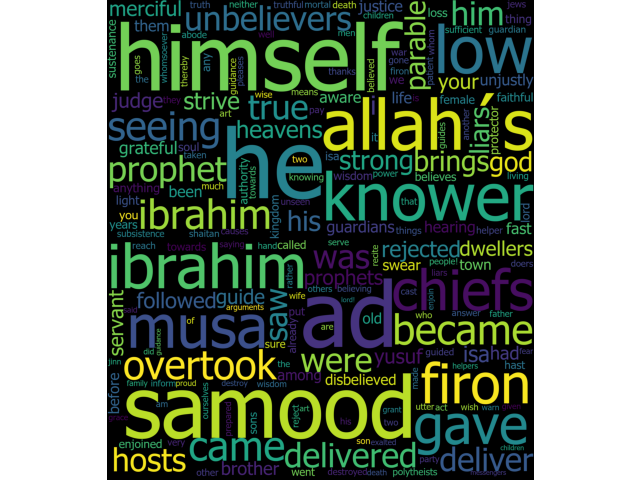
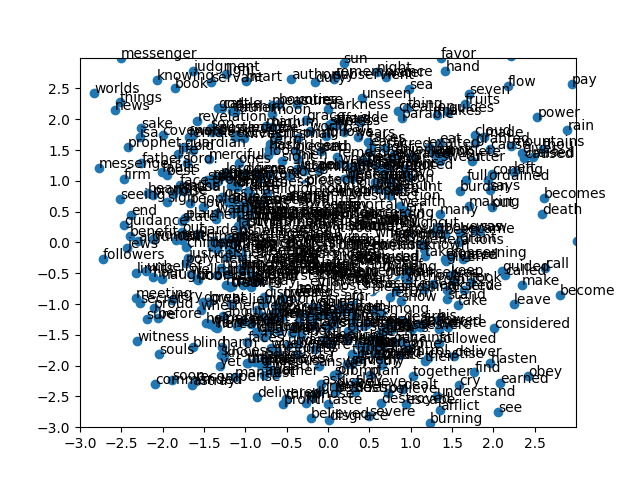

# Quran-Analysis
Quran analysis with some ML
Not sure where it will go and what will i learn from this


#Fork of quran-nlp (non arabic model and training)
https://github.com/aelbuni/quran-nlp/blob/master/README.md

Quran-Analysis is an opensource project that aims to provide a boilerplate to help researchers to mine for knowledge from the Quran in encglish

# Usage example

```
from quran_nlp.quran_nlp import QuranContextToWords
import matplotlib.pyplot as plt 

# Instantiate a new object
contextToWords = QuranContextToWords()

###################
# Parameter Tuning
###################
# min_count is for pruning the internal dictionary. 
# Words that appear only once or twice in a billion-word corpus are probably uninteresting typos and garbage.
min_count = 20
# The Word2Vec Skip-gram model, for example, 
# takes in pairs (word1, word2) generated by moving a window across text data, 
# and trains a 1-hidden-layer neural network based on the synthetic task of given an input word, 
# giving us a predicted probability distribution of nearby words to the input.
window = 7
# workers , the last of the major parameters (full list here) is for training parallelization, to speed up training:
workers = 8
# learning rate
alpha = 0.22

# Start the learning process and cache the model for use
contextToWords.process_quran_book(min_count, window, workers, alpha)

# Start using the model and play with visualization
# You can generate multiple plots through matlibplot as follows

#Scatter plott of all words.
plt.figure(1)
circle = plt.Circle((0, 0), radius=1, fc='w')
plt.gca().add_patch(circle)
plt.xlim([-3, 3])
plt.ylim([-3, 3])
plt.yticks(np.arange(-3, 3, .5))
plt.xticks(np.arange(-3, 3, .5))
plt.show
# Start using the model and play with visualization
plt.figure(2)
plt.subplot(211)
# Search for work Allah and something that's closest
word = 'allah'
print_similar_word_cloud(word, 100)

plt.subplot(212)
# Search for work nuh and something that's closest
word = 'nuh'
print_similar_word_cloud(word, 100)

```
## Plot results
>Plotting two figures, the first for `allah`, and the second is `nuh`



>Plotting scatter shot of all words
